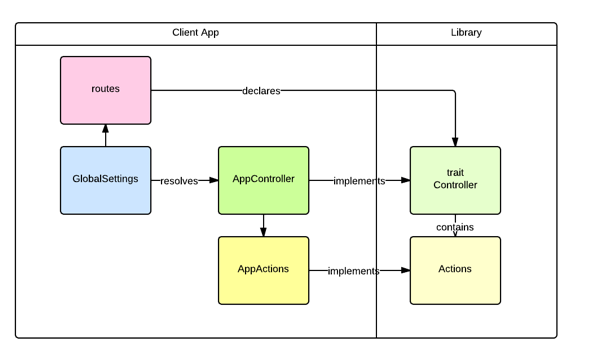

# Container

## Integrating the player/editor

The player and editor are designed for use within an external application.

This means that the external application needs to provide integration points to that the editor/player can load and save items

The simplest example of an integration is the `shell` module within the app. Have a look at `ContainerClientImplementation`.

Note: I hope to simplify how one can integrate by providing more sensible defaults.

Integration uses a decorator pattern, to allow clients to decorate the libraries core action logic.

The basic pattern of integration is as follows:

The controller trait contains the controller methods that are exposed in the routes file.

For example lets consider loading an Item. For this the library creates a controller:

    trait ItemController {

        def actions : ItemActions

        def load(id:String)  = actions.load(id){ itemRequest =>
            //item is loaded - do your work..
            Ok(itemRequest.item)
        }
    }

The controller contains an `ItemActions` trait:

    trait ItemActions{

        def load(id:String)(block: ItemRequest => Result) : Action[AnyContent]
    }

By implementing `ItemActions` the containing app can plugin any integration points, for example a dao:

    class AppItemActions extends ItemActions{
        override def load(id:String)(block:ItemRequest=> Result) : Action[AnyContent] = Action { request =>
            ItemDao.load(id).map{ item =>
                block(ItemRequest(item, r))
            }.getOrElse(NotFound(""))
        }
    }

This implementation will the be used by the controller implementation:

    class AppItemController extends ItemController{
        override def actions = new AppItemActions()
    }

### component-sets controller

This controller loads js and css for components. What to load is part of the url of the form:

    org[comp1,comp2,...]+org2[comp1,comp2,...]

Or if you want to load all the components for an org you can call:

    org[all]

This provides a simple uri that may be cached by the external app.

#### JS/Css processing

TODO: how to minify/gzip?